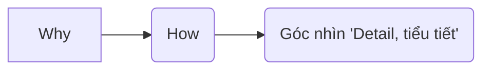

# Góc nhìn sau khi đọc: Clean code của uncle Bob.

Thông điệp truyền tải mạnh mẽ nhất xuyên suốt toàn bộ nội dung: là  "Clean code" - Mã sạch như đúng tiêu đề cuốn sách.

- Cuốn sách là một góc nhìn làm thế nào để biết viết code tốt hơn.
- Điểm đặc biệt ấn tượng là **tại sao** cần clean code và **làm thế nào** để đạt được điều đó qua các luận điểm và trình
  bày phong phú và đơn giản của tác giả.



## "Why" cần "clean code", cần trình bày rõ ràng

- Phần lớn thời gian chúng ta làm việc với một project là **ĐỌC HIỂU** project trước khi thêm hay sửa bất cứ thứ gì,
  ngay cả khi viết mới hoàn toàn thì nhu cầu này vẫn ở đó.

- Bạn hãy tưởng tượng:
    * Chúng ta đọc code
    * Để con trỏ chuột ở đầu một class rồi cuối phương thức
    * Rồi lại con trỏ chuột ở đầu một class khác rồi đến một phương thức khác
    * Thêm một logic
    * Rồi lại xem lại logic của class mới sửa
    * Xóa nó đi
    * Đọc một đoạn mã khác
    * Rồi thêm code
    * Đọc lại method vừa sửa
    * Và lại đổi tên nó  
      ....

  Quá trình cứ như lặp lại vậy nên **thời gian chúng ta thật sự đọc rất nhiều.**


- Chúng ta đọc mã để giao tiếp với những người đồng sự khác để hiểu requirements ngầm định trong đó. Đọc mã để hiểu
  conventions, để reuse, maintain, extend code đó lên, hoặc nữa là xác định điểm bắt đầu viết mới, xem lại xem mình có
  bỏ xót trường hợp nào không, có effect đến những phần code khác không, mình muốn bổ sung một điều kiện thì phải làm
  thế nào, hay đơn cử như một việc là tìm ra nguyên nhân cốt lỗi trong code...

- Vậy nên nếu việc đọc hiểu là quan trọng thì việc trình bày tốt để dễ dàng đọc hiểu là rất ưu tiên, là cần thiết.

- Một lập luật khác về việc trình bày ý tưởng trên, là sự liên kết, ảnh hưởng lần nhau giữa những phần, những chức năng,
  những phương thức.
  Mọi thứ đều liên quan đến nhau, nếu không có sự phụ thuộc hay bị phụ thuộc thì phần code đó không đang được sử dụng.
  Method A liên quan đến method B, nếu không trình bày cẩn trọng thì rất khó nhìn thấy mối quan hệ này. Từ A-B có thể
  phát triển thành sự ràng buộc cao hơn, phức tạp hơn rất nhiều. Nếu trình bày không cẩn thận, không rõ ràng, phân tách
  không phù hợp thì sẽ có vô vàn lỗi tiền ẩn và phụ thuộc chồng chéo. Sự tích lũy lỗi tiềm ẩn này đến một lúc nào đó, sẽ
  trở thành một gánh nặng, một 'Dev Debt' càng ngày càng lớn, cho đến lúc không trả được thì vỡ nợ. Nó âm thầm phá hủy
  toàn bộ kết cấu project, đến một lúc nào đó thì không thể maintain, thay đổi để đáp ứng nhu cầu của business nữa. Đó
  là khi hệ thống chết dần, chi phí sửa chưa ngày càng tăng một cách bất hợp lý.
  Tác giả cũng đề cập đến việc nếu chi phí sửa chữa tăng bằng việc viết mới và ta chấp nhận được thì ta có thể thử.
  Nhưng nếu vẫn không để ý đến maintain, refactor, tổ chức và trình bày thì chỉ là 'bình cũ rượu mới', rồi sẽ trở thành
  một mớ lộn độn như cũ.

Chưa kể một project quá lớn với một người, chúng ta cần một team để vận hành. Sự không hiểu ý lẫn nhau, lỗi tiềm ẩm,
trùng lắp, lộn xộn có thể nhân lên x người. Và sự trì trệ sẽ càng diễn ra nhanh chóng nếu ta không để tâm đến trình bày
rõ ràng.

- Đó là những gì đã từng diễn ra, cuốn sách là một bài học, là một giải pháp cho một bế tắc từ kinh nghiệm xương máu của
  những dự án đã qua, của những người đi trước. Tác giả đã chắt chiu viết cuốn sách và cộng đồng đã đón nhận nhiệt tình
  suốt nhiều năm, cho thấy đây là một điều cần phải để tâm. Và mình viết những dòng này với một sự biết ơn, thật khó để
  nhận ra những góc nhìn như vậy nếu không được chỉ dạy.
- Hơn nữa những nguyên tắc này phần nhiều rất đơn giản, điều này lại càng ý nghĩa hơn. Nếu nó là một chân lý thì nó đơn
  giản, ý này là luận điểm, Lão Tử từng đề cập trong Đạo đức kinh "Đạo sinh nhất, nhất sinh nhị, nhị sinh tam, tam sinh
  vạn vật". Chân lý là một sự đơn giản không phô trương.

Trên đây là phần trình bày về lý do cần viết mã sạch. Ý thức được điều gì là quan trọng là bước đi đầu tiên quan trọng.

## "How" to write "clean code"

Dưới đây là những nguyên tắc mà mình nhớ được sau khi đọc:

### Meaningful naming:

- Nó giống việc bạn muốn trình bày rõ ràng, bạn phải dùng từ phù hợp. Vậy nên đặt tên là phần đầu tiên.
- vd:
  ```
  // unclear names
    boolean check (int a, List b){
    return b.contains(a)
    }   
    -----
  // clear names
    boolean isSupportedVersion (int version, List supportedVersions){
      return supportedVersions.contains(version)
    }

- Cái tên vừa hay là một phần nan giải nếu bạn không rõ requirment thật khó để đặt một cái tên phù hợp.
  Phương pháp: đặt đi đặt lại đến khi tìm được một cái tên phù hợp tức là thể hiện được ý đồ code

- Một cái tên tốt:
    * Tuân theo conventions: Java thì có nguyên tắc con lạc đà, v -> method name, n -> class name, variable name
    * Phải thể hiện được mục đích, ý đồ chức năng của nó: không thiếu để không rõ ràng, không thừa để đảm bảo tính bao
      đóng cần thiết.
    * Không gây hiểu lầm, hay khó hiểu bằng viết tắt
    * Chỉnh chu: không sai chính tả để có thể search được khi cần
    *
        * Từ vựng phải có giới hạn lĩnh vực phù hợp, gồm:
    * Là những từ kỹ thuật chuyên môn để các đồng sự chúng ta hiểu với nhau.  
      Ví dụ: UserFactory -> programer có thể nhận ra Factory pattern đang được apply dụng
    * Là những từ chuyên ngành phù hợp của dự án (problem domain)
      Ví dụ: trong e-commerce, mình sẽ quen với những danh từ như: Order, Product, Delivery, Cart...

### Function

- Nếu ta xem meaningful naming là những vốn từ phù hợp, thì ta có thể xem Hàm/ function như một đoạn văn để truyền tải
  một thông điệp nào đó.
  Vì function được xem là một đơn vị nhỏ nhất trong một chương trình.

Làm sao để có một 'đoạn văn' tốt?

- Mục đích rõ ràng, đơn giản, dựa trên 2 nguyên tắc:
    * Ngắn gọn: súc tích, small
    * Do one thing: đơn nhiệm, dễ hiểu, single responsibility principle

- Phân tích cú pháp tổng quan của một function:

  ```mermaid
      graph LR
        A[Arguments/input] --> B(Function)
        B -->C(return value/ output/ no output: alter state, action)
        
        D[Data] --> E(algorithm)
        E -->F(Program)
  ```

    * Xét theo argument:
        * Rezo  : nilanic
        * One   : Monadic
        * Two   : Dyadic
        * Three : Triadic
        * More  : polyadic

  Tốt nhất là từ không có đến chỉ có 1 tham số. Như vậy thì hàm số đơn giản, dễ dùng vì người dùng không cần phải đọc
  lại signature để biết cách điền tham số đúng thứ tự và kiểu loại. Nhờ đó mà khi đọc mạch ý được khai thông liên tục
  không ngắt quãng, lợi lạc cho đọc hiểu hơn.

  Hơn nữa, nếu quá nhiều args thì khi test sẽ có rất nhiều trường hợp phải check.

    * Xét function với 1 tham số: Là kiểu phổ biến hơn cả

  | Type         	   | Input     	 	   | Function 				       | 	Output		     |
  |------------------|-----------------|---------------------|---------------|
  | Ask a question 	 | n = "name file" | fileExist(n)      	 | True/False		  |
  | Transform     	  | n = "name file" | fileOpen(n)       	 | OutputStream	 |
  | No output/ event | n = "name file" | logActionFile(n)    | No output		   |

    * Xét trường hợp từ 2 tham số:  
      * Ta có thể chuyển thành object vì nó đủ phức tạp để định nghĩa thành một object. Khi dùng sẽ dễ hơn, rõ ràng hơn,
      ít sai hơn. Ví dụ: x, y => Point(x,y)  
      * Khi ta khai báo 'arg ...' tức không xác định rõ số lượng thì có thể dùng 'List' để chuyển thành 1 tham số duy
      nhất và dễ xử lý hơn  
      * Phải xét đến abstraction level của argument cho phù hợp với function để không làm hỏng tính bao đóng. 
      
      Ví dụ: bạn muốn lấy phần trăm pin điện thoại thì chỉ cần: getRemainingBatteryPercentage() thay vì
      ```
      int total = getTotalBatteryCapacity()
      int time = getUsedTime()
      
      getRemainingBatteryPercentage(total, time)

    * Xét function side:
        * Hạn chế dùng error code vì khi đó logic có thể trở nên phức tạp hơn vì ta luôn phải if-else check.  
          Thay vào đó, mình nên dùng Exception vì:
            * Exception có thể mở rộng với inheritant, khi muốn thêm 1 loại thì không cần compile lại như việc sử dụng 1
              Error contains. Tuân thủ nguyên tắc, Open close principle.
            * Trong trường hợp, ta chỉ trả ra một exception thì business sẽ gọn hơn rất nhiều vì chỉ cần 1 lần try
              catch.
            * Nếu exception phức tạp, ta có thể tách việc xử lý exception ra làm một nhiệm vụ riêng.
        * Nếu function tuân theo SRP thì việc đặt một cái tên mô tả phù hợp sẽ dễ hơn.
        * Nên cân nhắc việc sử dụng inheritance thay vì switch vì nếu dùng switch khả năng cao bạn đang thực hiện nhiều
          hơn một nhiệm vụ: cụ thể là có thể dùng abstract factory.    
          Cũng tương tự, khi bạn dùng 1 flag argument trong function.

    * Xét output side:
        * Output argument: đó là trường hợp input lại trở thành output, như vậy thì cần phải đặt tên rõ ràng để người
          dùng không hiểu sai. Ví dụ: appendMessage(s, "tail") -> Nhưng nên chuyển thành s.append("tail") vì state của
          một object nên do chính object đó quản lý (ta có biến this)
        * No side effect: Thật là một thách thức nếu cái tên mô tả của method không phản ánh một phần nó tác động.  
     VD:
      ```
      boolean isValidPassword(String password){
          ...
          initSession();
          ...
      }
  Thật khó nếu người dùng cố gắng sự dụng một API khác cần session nhưng không gọi isValidPassword(pwd) trước đó.

**Kết luận**:  kích thước tổng thể của một hàm: tác giả có đưa ra những thông số tham khảo sau:

* **Parameters**: không nên quá dài, gây khó khăn cho việc đọc hiểu và sử dụng function  
  Số lượng parameter lý tưởng nên <4 -> max = 3
* 1 function chỉ thực hiện **một nhiệm vụ**, tức là phải tuân thủ nguyên tắc Single responsiblity Principle
* **Độ dài** trung bình lý tưởng của một hàm là từ 20 dòng đổ xuống.

**Lưu ý**:

* Nhưng một function cũng phải phù hợp về mặt kích thước mới thật sự nên tách, nếu không thì sẽ dẫn đến bùng nổ số lượng
  functions làm code khó đọc hơn, vì nhỏ quá, ta luôn phải chuyển đến phần chi tiết để theo dõi.  
  Nếu code của bạn đã thể hiển được ý đồ chức năng rồi thì không cần phải tách nó ra làm một function riêng.  
  Ví dụ:
  ```
  product_list 0--;
  -----------
  void decreaseProductQuantity(){
      product_list 0--;
  }
* Tác giả có đề cập đến stepdown với **TO** để cân nhắc mức độ trừu tượng phù hợp:  
  VD:

- To book Order:
    * To decrease each product
        * To check quantity of product
        * To decreate product
    * To move payment session
    * To export bill

**Phương pháp**:

- Viết một function đầu tiên, một bộ test case, áp dụng những nguyên tắc trên để refactor lại function đến khi thỏa mãn.
  Chỉnh đi chỉnh lại cho đến khi ngắn gọn, mục đích hàm rõ ràng, tên hàm mô tả đúng mục đích,...


